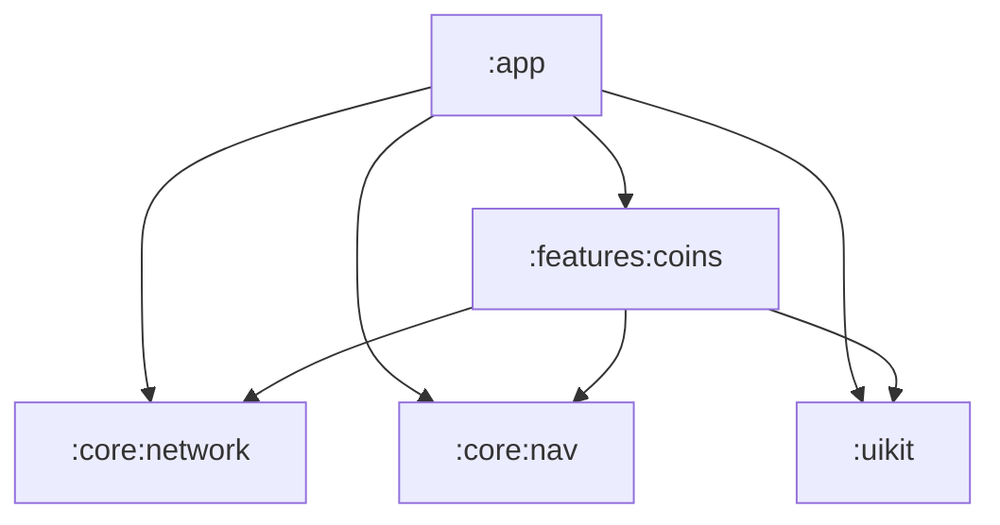

# CoinPulse

An offline-first cryptocurrency tracker for Android, built as a showcase of modern
Android architecture: Kotlin, Jetpack Compose, Navigation 3, a hand-rolled MVI layer
and a fully modularised Gradle setup driven by convention plugins.

> **Status: work in progress.** The build infrastructure and module structure are in
> place; feature work is underway. See [`BACKLOG.md`](BACKLOG.md) for the
> current plan and progress.

---

## Screenshots

_Coming with the first feature release._

---

## Planned features

- Live prices for top cryptocurrencies, sourced from CoinGecko
- Offline-first: cached data is served immediately, then refreshed from the network
- Coin detail screen with price history and 24h statistics
- Watchlist of favourite coins
- Price alerts delivered as notifications
- Light and dark themes with semantic market colours (up / down / flat)

---

## Tech stack

| Area | Choice |
|------|--------|
| Language | Kotlin |
| UI | Jetpack Compose, Material 3 |
| Navigation | Navigation 3 |
| Presentation | MVI, implemented from scratch (no framework) |
| DI | Hilt |
| Networking | Retrofit, OkHttp, kotlinx.serialization |
| Persistence | Room, DataStore |
| Async | Coroutines, Flow |
| Background work | WorkManager |
| Build | Gradle 9.5, AGP 9, KSP, convention plugins, version catalog |
| Testing | JUnit, MockK, Turbine, Robolectric, Roborazzi |

---

## Architecture

Clean Architecture with feature-based modularisation. Each feature owns its
presentation, domain and data layers; shared infrastructure lives in `core`.



**`build-logic`** — an included build holding the Gradle convention plugins.
Every module applies one of `coinpulse.android.application`, `.library`, `.feature`,
`.compose`, `.hilt` or `.room` instead of repeating configuration. Compile SDK,
min SDK and the JVM toolchain are defined in exactly one place.

**State management.** Screens are driven by a small MVI core: a `Store` reduces
`Intent`s into immutable `State` and emits one-off `Effect`s. It is written by hand
rather than pulled from a library — the whole point is to keep the state contract
explicit and the dependency surface small.

**Data flow.** Repositories expose `Flow` backed by Room. Network responses update
the database, and the database is the single source of truth for the UI, so the app
renders instantly on launch and stays usable without connectivity.

---

## Building

Requirements: Android Studio (latest stable) and JDK 17. The Gradle toolchain
resolver downloads a matching JDK automatically if one is not installed.

```bash
git clone https://github.com/dev-dias13/CoinPulse.git
cd CoinPulse
./gradlew assembleDebug
```

### API key

Market data comes from the [CoinGecko API](https://www.coingecko.com/en/api).
Create a free demo key, then add it to `local.properties` in the project root:

```properties
COINGECKO_API_KEY=your_key_here
```

`local.properties` is git-ignored; the key is exposed to the app through
`BuildConfig` at build time and is never committed.

---

## Project layout

```
CoinPulse/
├── app/                 Application entry point, DI root, navigation host
├── build-logic/         Gradle convention plugins
├── core/
│   ├── nav/             Navigation 3 setup and route keys
│   └── network/         HTTP client, serialization, API services
├── features/
│   └── coins/           Coin list and detail
└── uikit/               Theme, typography, shared composables
```

---

## Roadmap

Work is tracked in [`BACKLOG.md`](BACKLOG.md), grouped into milestones.
The near-term goal is a working coin list and detail screen backed by an
offline-first repository.

---

## License

Released under the Apache License 2.0. See [LICENSE](LICENSE).